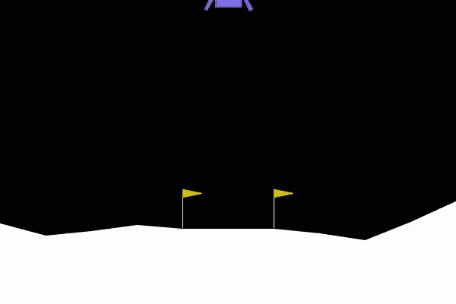
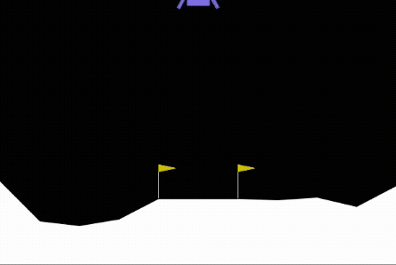
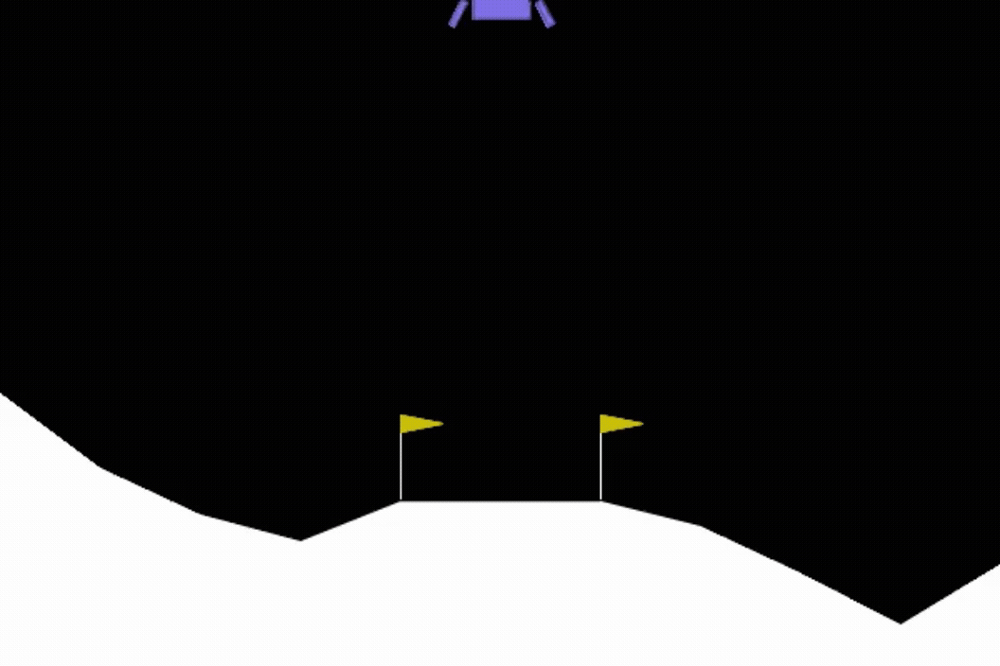
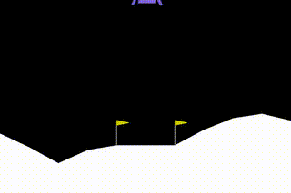
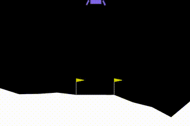

# Lunar Lander in PyTorch

## Results

### First Attempts

<table align="center">
  <tr>
    <td></td>
    <td></td>
    <td></td>
  </tr>
</table>

### Middle Attempts

<table align="center">
  <tr>
    <td></td>
    <td></td>
    <td></td>
  </tr>
</table>

### Last Attempts
