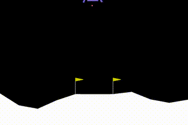

# Lunar Lander in PyTorch

## Results

### Initial Attempts

<table align="center">
  <tr>
    <td></td>
    <td></td>
    <td></td>
  </tr>
</table>

### Middle Attempts

<table align="center">
  <tr>
    <td></td>
    <td></td>
    <td></td>
  </tr>
</table>

### Final Attempts

<table align="center">
  <tr>
    <td></td>
    <td></td>
    <td></td>
  </tr>
</table>

## Settings

This table concludes the settings used to train the neural Q network, and experiment settings.

<table align="center">
    <tr>
        <td>#</td>
        <td>Variable</td>
        <td>Value</td>
        <td>Notes</td>
    </tr>
    <tr>
        <td>1</td>
        <td>Epsiodes</td>
        <td>500</td>
        <td>Total number of episodes.</td>
    </tr>
    <tr>
        <td>2</td>
        <td>$\gamma$</td>
        <td>0.95</td>
        <td>Future rewards importance.</td>
    </tr>
    <tr>
        <td>3</td>
        <td>$\epsilon$</td>
        <td>0.9</td>
        <td>Controls the trade-off between exploration and exploitation.</td>
    </tr>
    <tr>
        <td>4</td>
        <td>$\epsilon$ decay</td>
        <td>0.99104076</td>
        <td>Reaches the $\epsilon$ min in exactly 500 episodes.</td>
    </tr>
    <tr>
        <td>5</td>
        <td>$\tau$</td>
        <td>0.01</td>
        <td>Used in soft updates.</td>
    </tr>
    <tr>
        <td>6</td>
        <td>$\lambda$</td>
        <td>0.001</td>
        <td>Learning rate</td>
    </tr>
    <tr>
        <td>7</td>
        <td>$\theta$</td>
        <td>128</td>
        <td>Memory replay for consistent learning experience.</td>
    </tr>
</table>

## Reward Progress

